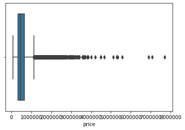
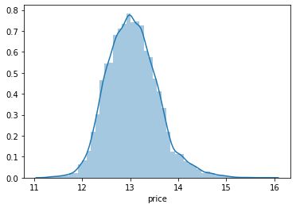
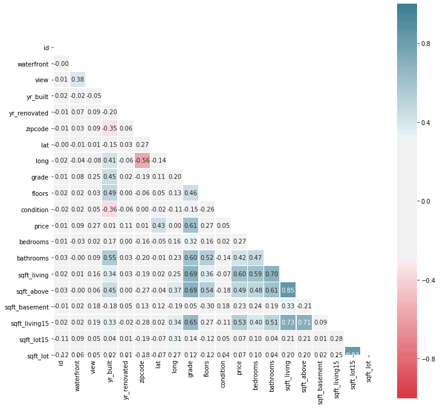
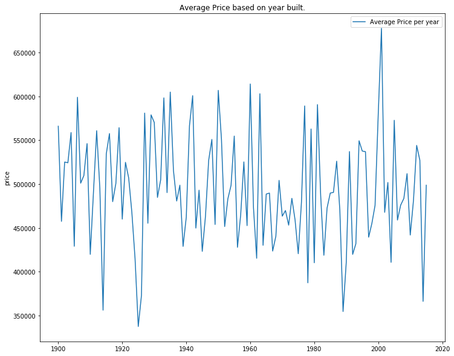
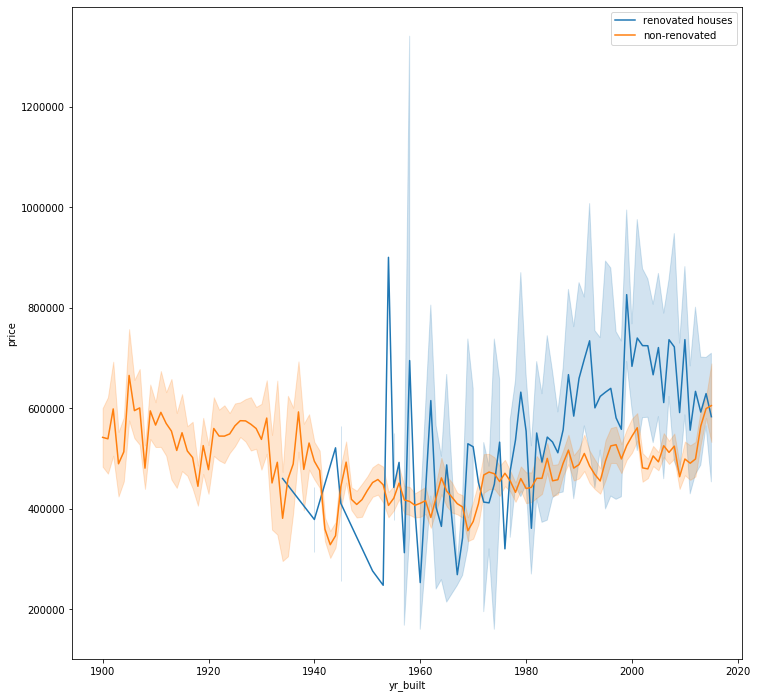
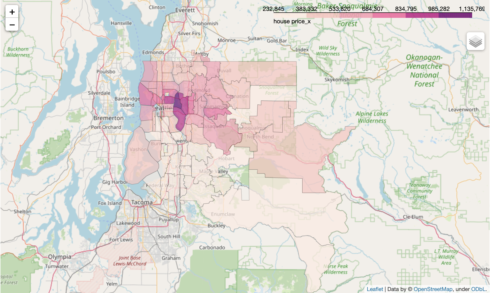
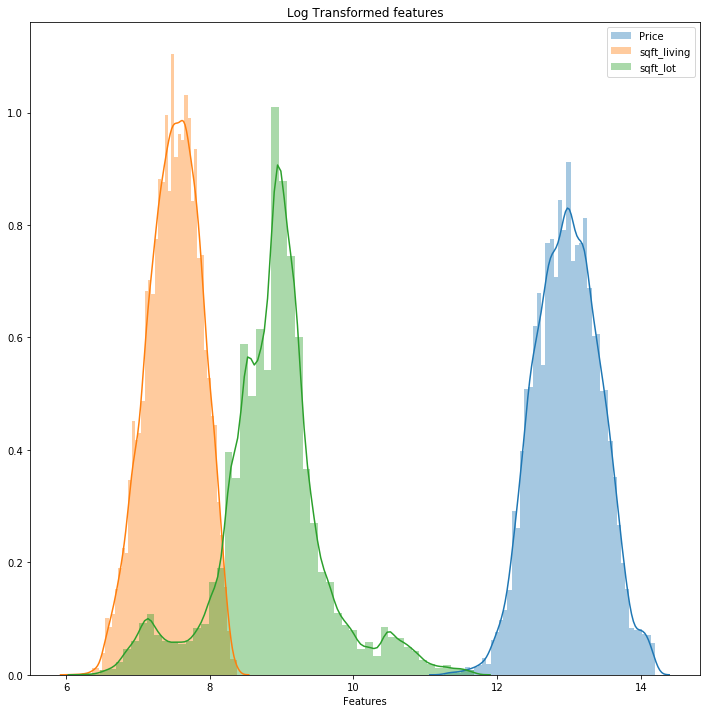
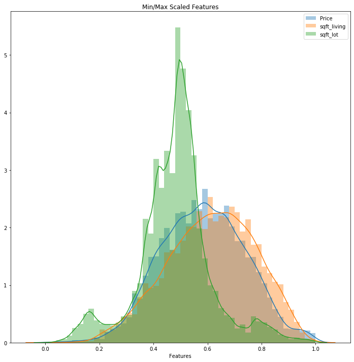
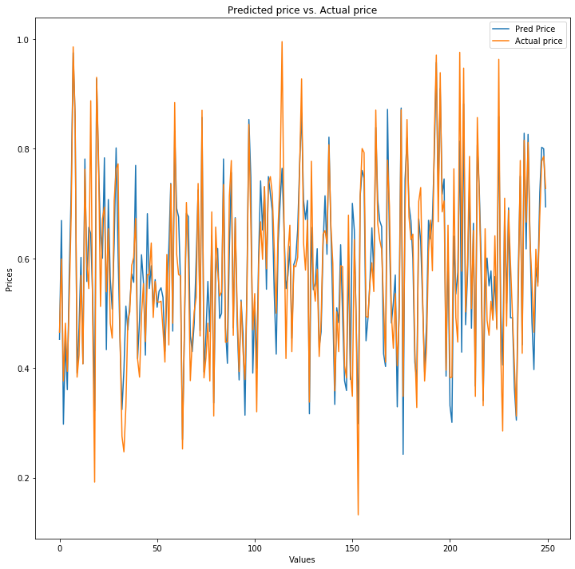

## Final Project Submission

Please fill out:
* Student name: Steven Jasper
* Student pace: part time
* Scheduled project review date/time: 
* Instructor name: Eli
* Blog post URL: 


# Column Names and descriptions for Kings County Data Set
* **id** - unique identified for a house
* **dateDate** - house was sold
* **pricePrice** -  is prediction target
* **bedroomsNumber** -  of Bedrooms/House
* **bathroomsNumber** -  of bathrooms/bedrooms
* **sqft_livingsquare** -  footage of the home
* **sqft_lotsquare** -  footage of the lot
* **floorsTotal** -  floors (levels) in house
* **waterfront** - House which has a view to a waterfront
* **view** - Has been viewed
* **condition** - How good the condition is ( Overall )
* **grade** - overall grade given to the housing unit, based on King County grading system
* **sqft_above** - square footage of house apart from basement
* **sqft_basement** - square footage of the basement
* **yr_built** - Built Year
* **yr_renovated** - Year when house was renovated
* **zipcode** - zip
* **lat** - Latitude coordinate
* **long** - Longitude coordinate
* **sqft_living15** - The square footage of interior housing living space for the nearest 15 neighbors
* **sqft_lot15** - The square footage of the land lots of the nearest 15 neighbors

# Methodology

We will be utilizing the OSEMN Process for building our model. This is described by 5 steps: 
* Obtain
* Scrub
* Explore
* Model
* Interpret

# Obtain/Scrub

We will begin with a provided data set. From here we will move forward and begin to scrub this data in the Data Cleaning and Manipulation section.


```python
# Your code here - remember to use markdown cells for comments as well!
# data manipulation, linear algebra, plotting
import pandas as pd
import numpy as np
import matplotlib.pyplot as plt
import seaborn as sns
import folium as F
import json
%matplotlib inline

# modeling, stat analysis 
from sklearn.linear_model import LinearRegression
from sklearn.model_selection import train_test_split
from sklearn.model_selection import cross_val_score
from sklearn import metrics
import statsmodels.api as sm
from scipy import stats

# Feature engineering
from sklearn.feature_selection import RFE

# scaling
from sklearn.preprocessing import MinMaxScaler

import warnings
pd.set_option('display.float_format', lambda x: '%.5f' % x)
```

## Data Cleaning and Manipulation


Given a data set from King's County we will begin manipulating our dataset in order to optimize for analysis. We will begin by loading the data, previewing the data, and then we will begin our cleaning process.


```python
df = pd.read_csv('kc_house_data.csv')
df.head()
```


<div>
<style scoped>
    .dataframe tbody tr th:only-of-type {
        vertical-align: middle;
    }

    .dataframe tbody tr th {
        vertical-align: top;
    }

    .dataframe thead th {
        text-align: right;
    }
</style>
<table border="1" class="dataframe">
  <thead>
    <tr style="text-align: right;">
      <th></th>
      <th>id</th>
      <th>date</th>
      <th>price</th>
      <th>bedrooms</th>
      <th>bathrooms</th>
      <th>sqft_living</th>
      <th>sqft_lot</th>
      <th>floors</th>
      <th>waterfront</th>
      <th>view</th>
      <th>...</th>
      <th>grade</th>
      <th>sqft_above</th>
      <th>sqft_basement</th>
      <th>yr_built</th>
      <th>yr_renovated</th>
      <th>zipcode</th>
      <th>lat</th>
      <th>long</th>
      <th>sqft_living15</th>
      <th>sqft_lot15</th>
    </tr>
  </thead>
  <tbody>
    <tr>
      <td>0</td>
      <td>7129300520</td>
      <td>10/13/2014</td>
      <td>221900.00000</td>
      <td>3</td>
      <td>1.00000</td>
      <td>1180</td>
      <td>5650</td>
      <td>1.00000</td>
      <td>nan</td>
      <td>0.00000</td>
      <td>...</td>
      <td>7</td>
      <td>1180</td>
      <td>0.0</td>
      <td>1955</td>
      <td>0.00000</td>
      <td>98178</td>
      <td>47.51120</td>
      <td>-122.25700</td>
      <td>1340</td>
      <td>5650</td>
    </tr>
    <tr>
      <td>1</td>
      <td>6414100192</td>
      <td>12/9/2014</td>
      <td>538000.00000</td>
      <td>3</td>
      <td>2.25000</td>
      <td>2570</td>
      <td>7242</td>
      <td>2.00000</td>
      <td>0.00000</td>
      <td>0.00000</td>
      <td>...</td>
      <td>7</td>
      <td>2170</td>
      <td>400.0</td>
      <td>1951</td>
      <td>1991.00000</td>
      <td>98125</td>
      <td>47.72100</td>
      <td>-122.31900</td>
      <td>1690</td>
      <td>7639</td>
    </tr>
    <tr>
      <td>2</td>
      <td>5631500400</td>
      <td>2/25/2015</td>
      <td>180000.00000</td>
      <td>2</td>
      <td>1.00000</td>
      <td>770</td>
      <td>10000</td>
      <td>1.00000</td>
      <td>0.00000</td>
      <td>0.00000</td>
      <td>...</td>
      <td>6</td>
      <td>770</td>
      <td>0.0</td>
      <td>1933</td>
      <td>nan</td>
      <td>98028</td>
      <td>47.73790</td>
      <td>-122.23300</td>
      <td>2720</td>
      <td>8062</td>
    </tr>
    <tr>
      <td>3</td>
      <td>2487200875</td>
      <td>12/9/2014</td>
      <td>604000.00000</td>
      <td>4</td>
      <td>3.00000</td>
      <td>1960</td>
      <td>5000</td>
      <td>1.00000</td>
      <td>0.00000</td>
      <td>0.00000</td>
      <td>...</td>
      <td>7</td>
      <td>1050</td>
      <td>910.0</td>
      <td>1965</td>
      <td>0.00000</td>
      <td>98136</td>
      <td>47.52080</td>
      <td>-122.39300</td>
      <td>1360</td>
      <td>5000</td>
    </tr>
    <tr>
      <td>4</td>
      <td>1954400510</td>
      <td>2/18/2015</td>
      <td>510000.00000</td>
      <td>3</td>
      <td>2.00000</td>
      <td>1680</td>
      <td>8080</td>
      <td>1.00000</td>
      <td>0.00000</td>
      <td>0.00000</td>
      <td>...</td>
      <td>8</td>
      <td>1680</td>
      <td>0.0</td>
      <td>1987</td>
      <td>0.00000</td>
      <td>98074</td>
      <td>47.61680</td>
      <td>-122.04500</td>
      <td>1800</td>
      <td>7503</td>
    </tr>
  </tbody>
</table>
<p>5 rows × 21 columns</p>
</div>


```python
df.info()
```

    <class 'pandas.core.frame.DataFrame'>
    RangeIndex: 21597 entries, 0 to 21596
    Data columns (total 21 columns):
    id               21597 non-null int64
    date             21597 non-null object
    price            21597 non-null float64
    bedrooms         21597 non-null int64
    bathrooms        21597 non-null float64
    sqft_living      21597 non-null int64
    sqft_lot         21597 non-null int64
    floors           21597 non-null float64
    waterfront       19221 non-null float64
    view             21534 non-null float64
    condition        21597 non-null int64
    grade            21597 non-null int64
    sqft_above       21597 non-null int64
    sqft_basement    21597 non-null object
    yr_built         21597 non-null int64
    yr_renovated     17755 non-null float64
    zipcode          21597 non-null int64
    lat              21597 non-null float64
    long             21597 non-null float64
    sqft_living15    21597 non-null int64
    sqft_lot15       21597 non-null int64
    dtypes: float64(8), int64(11), object(2)
    memory usage: 3.5+ MB


```python
df.sqft_basement.unique()
```


    array(['0.0', '400.0', '910.0', '1530.0', '?', '730.0', '1700.0', '300.0',
           '970.0', '760.0', '720.0', '700.0', '820.0', '780.0', '790.0',
           '330.0', '1620.0', '360.0', '588.0', '1510.0', '410.0', '990.0',
           '600.0', '560.0', '550.0', '1000.0', '1600.0', '500.0', '1040.0',
           '880.0', '1010.0', '240.0', '265.0', '290.0', '800.0', '540.0',
           '710.0', '840.0', '380.0', '770.0', '480.0', '570.0', '1490.0',
           '620.0', '1250.0', '1270.0', '120.0', '650.0', '180.0', '1130.0',
           '450.0', '1640.0', '1460.0', '1020.0', '1030.0', '750.0', '640.0',
           '1070.0', '490.0', '1310.0', '630.0', '2000.0', '390.0', '430.0',
           '850.0', '210.0', '1430.0', '1950.0', '440.0', '220.0', '1160.0',
           '860.0', '580.0', '2060.0', '1820.0', '1180.0', '200.0', '1150.0',
           '1200.0', '680.0', '530.0', '1450.0', '1170.0', '1080.0', '960.0',
           '280.0', '870.0', '1100.0', '460.0', '1400.0', '660.0', '1220.0',
           '900.0', '420.0', '1580.0', '1380.0', '475.0', '690.0', '270.0',
           '350.0', '935.0', '1370.0', '980.0', '1470.0', '160.0', '950.0',
           '50.0', '740.0', '1780.0', '1900.0', '340.0', '470.0', '370.0',
           '140.0', '1760.0', '130.0', '520.0', '890.0', '1110.0', '150.0',
           '1720.0', '810.0', '190.0', '1290.0', '670.0', '1800.0', '1120.0',
           '1810.0', '60.0', '1050.0', '940.0', '310.0', '930.0', '1390.0',
           '610.0', '1830.0', '1300.0', '510.0', '1330.0', '1590.0', '920.0',
           '1320.0', '1420.0', '1240.0', '1960.0', '1560.0', '2020.0',
           '1190.0', '2110.0', '1280.0', '250.0', '2390.0', '1230.0', '170.0',
           '830.0', '1260.0', '1410.0', '1340.0', '590.0', '1500.0', '1140.0',
           '260.0', '100.0', '320.0', '1480.0', '1060.0', '1284.0', '1670.0',
           '1350.0', '2570.0', '1090.0', '110.0', '2500.0', '90.0', '1940.0',
           '1550.0', '2350.0', '2490.0', '1481.0', '1360.0', '1135.0',
           '1520.0', '1850.0', '1660.0', '2130.0', '2600.0', '1690.0',
           '243.0', '1210.0', '1024.0', '1798.0', '1610.0', '1440.0',
           '1570.0', '1650.0', '704.0', '1910.0', '1630.0', '2360.0',
           '1852.0', '2090.0', '2400.0', '1790.0', '2150.0', '230.0', '70.0',
           '1680.0', '2100.0', '3000.0', '1870.0', '1710.0', '2030.0',
           '875.0', '1540.0', '2850.0', '2170.0', '506.0', '906.0', '145.0',
           '2040.0', '784.0', '1750.0', '374.0', '518.0', '2720.0', '2730.0',
           '1840.0', '3480.0', '2160.0', '1920.0', '2330.0', '1860.0',
           '2050.0', '4820.0', '1913.0', '80.0', '2010.0', '3260.0', '2200.0',
           '415.0', '1730.0', '652.0', '2196.0', '1930.0', '515.0', '40.0',
           '2080.0', '2580.0', '1548.0', '1740.0', '235.0', '861.0', '1890.0',
           '2220.0', '792.0', '2070.0', '4130.0', '2250.0', '2240.0',
           '1990.0', '768.0', '2550.0', '435.0', '1008.0', '2300.0', '2610.0',
           '666.0', '3500.0', '172.0', '1816.0', '2190.0', '1245.0', '1525.0',
           '1880.0', '862.0', '946.0', '1281.0', '414.0', '2180.0', '276.0',
           '1248.0', '602.0', '516.0', '176.0', '225.0', '1275.0', '266.0',
           '283.0', '65.0', '2310.0', '10.0', '1770.0', '2120.0', '295.0',
           '207.0', '915.0', '556.0', '417.0', '143.0', '508.0', '2810.0',
           '20.0', '274.0', '248.0'], dtype=object)


We can see above that there are some values that would not be able to be converted to a float. We would like this data to be a float so we can actually apply some statistical concepts to this series.


```python
# Here we are replacing our placeholder for no basement with a 0
df.loc[df.sqft_basement == '?'] = 0
```


```python
# Converts data type from string to float
df['sqft_basement'] = df.sqft_basement.astype('float64')
```

Now that we converted our sqft_basement to a float, we want to take a look at other columns with data types that are not condusive to our analysis. The next one we will be converting is the date column, we would like this to be a datetime type vs an object type.


```python
# convert date from object to date time
df['date'] = pd.to_datetime(df.date, infer_datetime_format = True)
```


```python
# validate that conversion appears properly
df.date.describe()
```


    count                   21597
    unique                    373
    top       1970-01-01 00:00:00
    freq                      454
    first     1970-01-01 00:00:00
    last      2015-05-27 00:00:00
    Name: date, dtype: object


Our Data types are starting to come together much better, now we would like to begin replacing more placeholder values as seen above in our basement example.


```python
# list all columns and determine the number of null values
df.isna().sum()
```


    id                  0
    date                0
    price               0
    bedrooms            0
    bathrooms           0
    sqft_living         0
    sqft_lot            0
    floors              0
    waterfront       2339
    view               61
    condition           0
    grade               0
    sqft_above          0
    sqft_basement       0
    yr_built            0
    yr_renovated     3754
    zipcode             0
    lat                 0
    long                0
    sqft_living15       0
    sqft_lot15          0
    dtype: int64


We can see above there are a few columns with undesirable data, we must interpret this data and then fill the null values with a valid placeholder value.

It is safe to assume that if the property has no waterfront the value will be 0, however what does NaN imply? I believe it would be safe to assume these too would be houses without waterfront qualities.


```python
df.waterfront.head()
```


    0       nan
    1   0.00000
    2   0.00000
    3   0.00000
    4   0.00000
    Name: waterfront, dtype: float64


```python
# fill null values with 0 meaning that they are not waterfront
df['waterfront'] = df.waterfront.fillna(0)
```


```python
df.waterfront.unique()
```


    array([0., 1.])


Now that our waterfront property is looking quite a bit better, we would like to start looking at view, and yr_renovated. We will preview these, then determine what the best filler value will be for the set.


```python
# fill view columns with 0 meaning the house has not been viewed for sale
df['view'] = df.view.fillna(0)
```


```python
df.view.unique()
```


    array([0., 3., 4., 2., 1.])


```python
df.yr_renovated.isna().sum()
```


    3754


```python
# fill null with 0 meaning that the house has not been renovated
df['yr_renovated'] = df.yr_renovated.fillna(0)
```


```python
df.yr_renovated.unique()
```


    array([   0., 1991., 2002., 2010., 1992., 2013., 1994., 1978., 2005.,
           2003., 1984., 1954., 2014., 2011., 1983., 1945., 1990., 1988.,
           1977., 1981., 1995., 2000., 1999., 1998., 1970., 1989., 2004.,
           1986., 2007., 1987., 2006., 1985., 1980., 1971., 1979., 1997.,
           1950., 1969., 1948., 2009., 2015., 1974., 2008., 1968., 2012.,
           1963., 1951., 1962., 2001., 1953., 1993., 1996., 1955., 1982.,
           1956., 1940., 1976., 1975., 1964., 1973., 1957., 1959., 1960.,
           1967., 1965., 1934., 1972., 1944., 1958.])


We utilized 0 as the baseline placeholder since these values will eventually be utilized in our analysis in a numerical sense. For yr_renovated 0 signifies that the house has not been renovated, while in view it means the house has not been viewed yet.


```python
df.price.describe()
```


    count     21597.00000
    mean     529148.41459
    std      372349.00379
    min           0.00000
    25%      315000.00000
    50%      445000.00000
    75%      638000.00000
    max     7700000.00000
    Name: price, dtype: float64


```python
# find price data that is 0, we will drop these values to keep data 'pure'
foo = df.loc[df.price < 10]
```

We can see above that we have a large amount of data that is basically blank. We will work to remove this invalid data once we validate that all of this data is legitimately incorrect.


```python
foo.describe()
```


<div>
<style scoped>
    .dataframe tbody tr th:only-of-type {
        vertical-align: middle;
    }

    .dataframe tbody tr th {
        vertical-align: top;
    }

    .dataframe thead th {
        text-align: right;
    }
</style>
<table border="1" class="dataframe">
  <thead>
    <tr style="text-align: right;">
      <th></th>
      <th>id</th>
      <th>price</th>
      <th>bedrooms</th>
      <th>bathrooms</th>
      <th>sqft_living</th>
      <th>sqft_lot</th>
      <th>floors</th>
      <th>waterfront</th>
      <th>view</th>
      <th>condition</th>
      <th>grade</th>
      <th>sqft_above</th>
      <th>sqft_basement</th>
      <th>yr_built</th>
      <th>yr_renovated</th>
      <th>zipcode</th>
      <th>lat</th>
      <th>long</th>
      <th>sqft_living15</th>
      <th>sqft_lot15</th>
    </tr>
  </thead>
  <tbody>
    <tr>
      <td>count</td>
      <td>454.00000</td>
      <td>454.00000</td>
      <td>454.00000</td>
      <td>454.00000</td>
      <td>454.00000</td>
      <td>454.00000</td>
      <td>454.00000</td>
      <td>454.00000</td>
      <td>454.00000</td>
      <td>454.00000</td>
      <td>454.00000</td>
      <td>454.00000</td>
      <td>454.00000</td>
      <td>454.00000</td>
      <td>454.00000</td>
      <td>454.00000</td>
      <td>454.00000</td>
      <td>454.00000</td>
      <td>454.00000</td>
      <td>454.00000</td>
    </tr>
    <tr>
      <td>mean</td>
      <td>0.00000</td>
      <td>0.00000</td>
      <td>0.00000</td>
      <td>0.00000</td>
      <td>0.00000</td>
      <td>0.00000</td>
      <td>0.00000</td>
      <td>0.00000</td>
      <td>0.00000</td>
      <td>0.00000</td>
      <td>0.00000</td>
      <td>0.00000</td>
      <td>0.00000</td>
      <td>0.00000</td>
      <td>0.00000</td>
      <td>0.00000</td>
      <td>0.00000</td>
      <td>0.00000</td>
      <td>0.00000</td>
      <td>0.00000</td>
    </tr>
    <tr>
      <td>std</td>
      <td>0.00000</td>
      <td>0.00000</td>
      <td>0.00000</td>
      <td>0.00000</td>
      <td>0.00000</td>
      <td>0.00000</td>
      <td>0.00000</td>
      <td>0.00000</td>
      <td>0.00000</td>
      <td>0.00000</td>
      <td>0.00000</td>
      <td>0.00000</td>
      <td>0.00000</td>
      <td>0.00000</td>
      <td>0.00000</td>
      <td>0.00000</td>
      <td>0.00000</td>
      <td>0.00000</td>
      <td>0.00000</td>
      <td>0.00000</td>
    </tr>
    <tr>
      <td>min</td>
      <td>0.00000</td>
      <td>0.00000</td>
      <td>0.00000</td>
      <td>0.00000</td>
      <td>0.00000</td>
      <td>0.00000</td>
      <td>0.00000</td>
      <td>0.00000</td>
      <td>0.00000</td>
      <td>0.00000</td>
      <td>0.00000</td>
      <td>0.00000</td>
      <td>0.00000</td>
      <td>0.00000</td>
      <td>0.00000</td>
      <td>0.00000</td>
      <td>0.00000</td>
      <td>0.00000</td>
      <td>0.00000</td>
      <td>0.00000</td>
    </tr>
    <tr>
      <td>25%</td>
      <td>0.00000</td>
      <td>0.00000</td>
      <td>0.00000</td>
      <td>0.00000</td>
      <td>0.00000</td>
      <td>0.00000</td>
      <td>0.00000</td>
      <td>0.00000</td>
      <td>0.00000</td>
      <td>0.00000</td>
      <td>0.00000</td>
      <td>0.00000</td>
      <td>0.00000</td>
      <td>0.00000</td>
      <td>0.00000</td>
      <td>0.00000</td>
      <td>0.00000</td>
      <td>0.00000</td>
      <td>0.00000</td>
      <td>0.00000</td>
    </tr>
    <tr>
      <td>50%</td>
      <td>0.00000</td>
      <td>0.00000</td>
      <td>0.00000</td>
      <td>0.00000</td>
      <td>0.00000</td>
      <td>0.00000</td>
      <td>0.00000</td>
      <td>0.00000</td>
      <td>0.00000</td>
      <td>0.00000</td>
      <td>0.00000</td>
      <td>0.00000</td>
      <td>0.00000</td>
      <td>0.00000</td>
      <td>0.00000</td>
      <td>0.00000</td>
      <td>0.00000</td>
      <td>0.00000</td>
      <td>0.00000</td>
      <td>0.00000</td>
    </tr>
    <tr>
      <td>75%</td>
      <td>0.00000</td>
      <td>0.00000</td>
      <td>0.00000</td>
      <td>0.00000</td>
      <td>0.00000</td>
      <td>0.00000</td>
      <td>0.00000</td>
      <td>0.00000</td>
      <td>0.00000</td>
      <td>0.00000</td>
      <td>0.00000</td>
      <td>0.00000</td>
      <td>0.00000</td>
      <td>0.00000</td>
      <td>0.00000</td>
      <td>0.00000</td>
      <td>0.00000</td>
      <td>0.00000</td>
      <td>0.00000</td>
      <td>0.00000</td>
    </tr>
    <tr>
      <td>max</td>
      <td>0.00000</td>
      <td>0.00000</td>
      <td>0.00000</td>
      <td>0.00000</td>
      <td>0.00000</td>
      <td>0.00000</td>
      <td>0.00000</td>
      <td>0.00000</td>
      <td>0.00000</td>
      <td>0.00000</td>
      <td>0.00000</td>
      <td>0.00000</td>
      <td>0.00000</td>
      <td>0.00000</td>
      <td>0.00000</td>
      <td>0.00000</td>
      <td>0.00000</td>
      <td>0.00000</td>
      <td>0.00000</td>
      <td>0.00000</td>
    </tr>
  </tbody>
</table>
</div>


Above validates that this data is truly invalid as there are no values throughout our subset.


```python
# remove all of the prices that are 0 from the foo dataframe
df = pd.merge(df, foo, how='outer', indicator=True).query('_merge == "left_only"').drop('_merge', 1)
```


```python
df.describe()
```


<div>
<style scoped>
    .dataframe tbody tr th:only-of-type {
        vertical-align: middle;
    }

    .dataframe tbody tr th {
        vertical-align: top;
    }

    .dataframe thead th {
        text-align: right;
    }
</style>
<table border="1" class="dataframe">
  <thead>
    <tr style="text-align: right;">
      <th></th>
      <th>id</th>
      <th>price</th>
      <th>bedrooms</th>
      <th>bathrooms</th>
      <th>sqft_living</th>
      <th>sqft_lot</th>
      <th>floors</th>
      <th>waterfront</th>
      <th>view</th>
      <th>condition</th>
      <th>grade</th>
      <th>sqft_above</th>
      <th>sqft_basement</th>
      <th>yr_built</th>
      <th>yr_renovated</th>
      <th>zipcode</th>
      <th>lat</th>
      <th>long</th>
      <th>sqft_living15</th>
      <th>sqft_lot15</th>
    </tr>
  </thead>
  <tbody>
    <tr>
      <td>count</td>
      <td>21143.00000</td>
      <td>21143.00000</td>
      <td>21143.00000</td>
      <td>21143.00000</td>
      <td>21143.00000</td>
      <td>21143.00000</td>
      <td>21143.00000</td>
      <td>21143.00000</td>
      <td>21143.00000</td>
      <td>21143.00000</td>
      <td>21143.00000</td>
      <td>21143.00000</td>
      <td>21143.00000</td>
      <td>21143.00000</td>
      <td>21143.00000</td>
      <td>21143.00000</td>
      <td>21143.00000</td>
      <td>21143.00000</td>
      <td>21143.00000</td>
      <td>21143.00000</td>
    </tr>
    <tr>
      <td>mean</td>
      <td>4581004249.84827</td>
      <td>540510.72743</td>
      <td>3.37256</td>
      <td>2.11608</td>
      <td>2080.92073</td>
      <td>15087.13782</td>
      <td>1.49359</td>
      <td>0.00672</td>
      <td>0.23265</td>
      <td>3.40992</td>
      <td>7.65828</td>
      <td>1789.06901</td>
      <td>291.85172</td>
      <td>1971.02322</td>
      <td>68.25649</td>
      <td>98077.86889</td>
      <td>47.56027</td>
      <td>-122.21388</td>
      <td>1987.27139</td>
      <td>12738.94197</td>
    </tr>
    <tr>
      <td>std</td>
      <td>2876328198.00068</td>
      <td>368075.06437</td>
      <td>0.92492</td>
      <td>0.76853</td>
      <td>918.54756</td>
      <td>41209.20008</td>
      <td>0.53925</td>
      <td>0.08168</td>
      <td>0.76406</td>
      <td>0.65050</td>
      <td>1.17425</td>
      <td>828.40977</td>
      <td>442.49834</td>
      <td>29.32194</td>
      <td>362.76583</td>
      <td>53.53576</td>
      <td>0.13859</td>
      <td>0.14060</td>
      <td>685.67034</td>
      <td>27169.27366</td>
    </tr>
    <tr>
      <td>min</td>
      <td>1000102.00000</td>
      <td>78000.00000</td>
      <td>1.00000</td>
      <td>0.50000</td>
      <td>370.00000</td>
      <td>520.00000</td>
      <td>1.00000</td>
      <td>0.00000</td>
      <td>0.00000</td>
      <td>1.00000</td>
      <td>3.00000</td>
      <td>370.00000</td>
      <td>0.00000</td>
      <td>1900.00000</td>
      <td>0.00000</td>
      <td>98001.00000</td>
      <td>47.15590</td>
      <td>-122.51900</td>
      <td>399.00000</td>
      <td>651.00000</td>
    </tr>
    <tr>
      <td>25%</td>
      <td>2123049307.00000</td>
      <td>322000.00000</td>
      <td>3.00000</td>
      <td>1.75000</td>
      <td>1430.00000</td>
      <td>5043.00000</td>
      <td>1.00000</td>
      <td>0.00000</td>
      <td>0.00000</td>
      <td>3.00000</td>
      <td>7.00000</td>
      <td>1200.00000</td>
      <td>0.00000</td>
      <td>1952.00000</td>
      <td>0.00000</td>
      <td>98033.00000</td>
      <td>47.47125</td>
      <td>-122.32800</td>
      <td>1490.00000</td>
      <td>5100.00000</td>
    </tr>
    <tr>
      <td>50%</td>
      <td>3904940140.00000</td>
      <td>450000.00000</td>
      <td>3.00000</td>
      <td>2.25000</td>
      <td>1910.00000</td>
      <td>7620.00000</td>
      <td>1.50000</td>
      <td>0.00000</td>
      <td>0.00000</td>
      <td>3.00000</td>
      <td>7.00000</td>
      <td>1560.00000</td>
      <td>0.00000</td>
      <td>1975.00000</td>
      <td>0.00000</td>
      <td>98065.00000</td>
      <td>47.57200</td>
      <td>-122.23000</td>
      <td>1840.00000</td>
      <td>7626.00000</td>
    </tr>
    <tr>
      <td>75%</td>
      <td>7309100170.00000</td>
      <td>645000.00000</td>
      <td>4.00000</td>
      <td>2.50000</td>
      <td>2550.00000</td>
      <td>10695.50000</td>
      <td>2.00000</td>
      <td>0.00000</td>
      <td>0.00000</td>
      <td>4.00000</td>
      <td>8.00000</td>
      <td>2210.00000</td>
      <td>560.00000</td>
      <td>1997.00000</td>
      <td>0.00000</td>
      <td>98117.00000</td>
      <td>47.67820</td>
      <td>-122.12500</td>
      <td>2360.00000</td>
      <td>10087.00000</td>
    </tr>
    <tr>
      <td>max</td>
      <td>9900000190.00000</td>
      <td>7700000.00000</td>
      <td>33.00000</td>
      <td>8.00000</td>
      <td>13540.00000</td>
      <td>1651359.00000</td>
      <td>3.50000</td>
      <td>1.00000</td>
      <td>4.00000</td>
      <td>5.00000</td>
      <td>13.00000</td>
      <td>9410.00000</td>
      <td>4820.00000</td>
      <td>2015.00000</td>
      <td>2015.00000</td>
      <td>98199.00000</td>
      <td>47.77760</td>
      <td>-121.31500</td>
      <td>6210.00000</td>
      <td>871200.00000</td>
    </tr>
  </tbody>
</table>
</div>


## Dealing with Outliers

We can see below, we have a large amount of quite aggressive outliers, this will lead to a non-normal distribution, we will begin to remove these. We will do this by taking the Z-Score of all the values for price, and remove values with large Z-Scores.


```python
# view the outliers for the price column
sns.boxplot(df.price)
```


    <matplotlib.axes._subplots.AxesSubplot at 0x1c1d0f8490>





```python
# split data to qualitative and quantitative
qual = ['date', 'id', 'waterfront', 'view', 'yr_built', 'yr_renovated', 'zipcode', 'lat', 'long', 'grade', 'floors', 'condition']
quan = ['price', 'bedrooms', 'bathrooms', 'sqft_living', 'sqft_above', 'sqft_basement', 'sqft_living15', 'sqft_lot15', 'sqft_lot']
```


```python
df.head(12)
```


<div>
<style scoped>
    .dataframe tbody tr th:only-of-type {
        vertical-align: middle;
    }

    .dataframe tbody tr th {
        vertical-align: top;
    }

    .dataframe thead th {
        text-align: right;
    }
</style>
<table border="1" class="dataframe">
  <thead>
    <tr style="text-align: right;">
      <th></th>
      <th>id</th>
      <th>date</th>
      <th>price</th>
      <th>bedrooms</th>
      <th>bathrooms</th>
      <th>sqft_living</th>
      <th>sqft_lot</th>
      <th>floors</th>
      <th>waterfront</th>
      <th>view</th>
      <th>...</th>
      <th>grade</th>
      <th>sqft_above</th>
      <th>sqft_basement</th>
      <th>yr_built</th>
      <th>yr_renovated</th>
      <th>zipcode</th>
      <th>lat</th>
      <th>long</th>
      <th>sqft_living15</th>
      <th>sqft_lot15</th>
    </tr>
  </thead>
  <tbody>
    <tr>
      <td>0</td>
      <td>7129300520</td>
      <td>2014-10-13</td>
      <td>221900.00000</td>
      <td>3</td>
      <td>1.00000</td>
      <td>1180</td>
      <td>5650</td>
      <td>1.00000</td>
      <td>0.00000</td>
      <td>0.00000</td>
      <td>...</td>
      <td>7</td>
      <td>1180</td>
      <td>0.00000</td>
      <td>1955</td>
      <td>0.00000</td>
      <td>98178</td>
      <td>47.51120</td>
      <td>-122.25700</td>
      <td>1340</td>
      <td>5650</td>
    </tr>
    <tr>
      <td>1</td>
      <td>6414100192</td>
      <td>2014-12-09</td>
      <td>538000.00000</td>
      <td>3</td>
      <td>2.25000</td>
      <td>2570</td>
      <td>7242</td>
      <td>2.00000</td>
      <td>0.00000</td>
      <td>0.00000</td>
      <td>...</td>
      <td>7</td>
      <td>2170</td>
      <td>400.00000</td>
      <td>1951</td>
      <td>1991.00000</td>
      <td>98125</td>
      <td>47.72100</td>
      <td>-122.31900</td>
      <td>1690</td>
      <td>7639</td>
    </tr>
    <tr>
      <td>2</td>
      <td>5631500400</td>
      <td>2015-02-25</td>
      <td>180000.00000</td>
      <td>2</td>
      <td>1.00000</td>
      <td>770</td>
      <td>10000</td>
      <td>1.00000</td>
      <td>0.00000</td>
      <td>0.00000</td>
      <td>...</td>
      <td>6</td>
      <td>770</td>
      <td>0.00000</td>
      <td>1933</td>
      <td>0.00000</td>
      <td>98028</td>
      <td>47.73790</td>
      <td>-122.23300</td>
      <td>2720</td>
      <td>8062</td>
    </tr>
    <tr>
      <td>3</td>
      <td>2487200875</td>
      <td>2014-12-09</td>
      <td>604000.00000</td>
      <td>4</td>
      <td>3.00000</td>
      <td>1960</td>
      <td>5000</td>
      <td>1.00000</td>
      <td>0.00000</td>
      <td>0.00000</td>
      <td>...</td>
      <td>7</td>
      <td>1050</td>
      <td>910.00000</td>
      <td>1965</td>
      <td>0.00000</td>
      <td>98136</td>
      <td>47.52080</td>
      <td>-122.39300</td>
      <td>1360</td>
      <td>5000</td>
    </tr>
    <tr>
      <td>4</td>
      <td>1954400510</td>
      <td>2015-02-18</td>
      <td>510000.00000</td>
      <td>3</td>
      <td>2.00000</td>
      <td>1680</td>
      <td>8080</td>
      <td>1.00000</td>
      <td>0.00000</td>
      <td>0.00000</td>
      <td>...</td>
      <td>8</td>
      <td>1680</td>
      <td>0.00000</td>
      <td>1987</td>
      <td>0.00000</td>
      <td>98074</td>
      <td>47.61680</td>
      <td>-122.04500</td>
      <td>1800</td>
      <td>7503</td>
    </tr>
    <tr>
      <td>5</td>
      <td>7237550310</td>
      <td>2014-05-12</td>
      <td>1230000.00000</td>
      <td>4</td>
      <td>4.50000</td>
      <td>5420</td>
      <td>101930</td>
      <td>1.00000</td>
      <td>0.00000</td>
      <td>0.00000</td>
      <td>...</td>
      <td>11</td>
      <td>3890</td>
      <td>1530.00000</td>
      <td>2001</td>
      <td>0.00000</td>
      <td>98053</td>
      <td>47.65610</td>
      <td>-122.00500</td>
      <td>4760</td>
      <td>101930</td>
    </tr>
    <tr>
      <td>206122</td>
      <td>2008000270</td>
      <td>2015-01-15</td>
      <td>291850.00000</td>
      <td>3</td>
      <td>1.50000</td>
      <td>1060</td>
      <td>9711</td>
      <td>1.00000</td>
      <td>0.00000</td>
      <td>0.00000</td>
      <td>...</td>
      <td>7</td>
      <td>1060</td>
      <td>0.00000</td>
      <td>1963</td>
      <td>0.00000</td>
      <td>98198</td>
      <td>47.40950</td>
      <td>-122.31500</td>
      <td>1650</td>
      <td>9711</td>
    </tr>
    <tr>
      <td>206123</td>
      <td>2414600126</td>
      <td>2015-04-15</td>
      <td>229500.00000</td>
      <td>3</td>
      <td>1.00000</td>
      <td>1780</td>
      <td>7470</td>
      <td>1.00000</td>
      <td>0.00000</td>
      <td>0.00000</td>
      <td>...</td>
      <td>7</td>
      <td>1050</td>
      <td>730.00000</td>
      <td>1960</td>
      <td>0.00000</td>
      <td>98146</td>
      <td>47.51230</td>
      <td>-122.33700</td>
      <td>1780</td>
      <td>8113</td>
    </tr>
    <tr>
      <td>206124</td>
      <td>3793500160</td>
      <td>2015-03-12</td>
      <td>323000.00000</td>
      <td>3</td>
      <td>2.50000</td>
      <td>1890</td>
      <td>6560</td>
      <td>2.00000</td>
      <td>0.00000</td>
      <td>0.00000</td>
      <td>...</td>
      <td>7</td>
      <td>1890</td>
      <td>0.00000</td>
      <td>2003</td>
      <td>0.00000</td>
      <td>98038</td>
      <td>47.36840</td>
      <td>-122.03100</td>
      <td>2390</td>
      <td>7570</td>
    </tr>
    <tr>
      <td>206125</td>
      <td>1736800520</td>
      <td>2015-04-03</td>
      <td>662500.00000</td>
      <td>3</td>
      <td>2.50000</td>
      <td>3560</td>
      <td>9796</td>
      <td>1.00000</td>
      <td>0.00000</td>
      <td>0.00000</td>
      <td>...</td>
      <td>8</td>
      <td>1860</td>
      <td>1700.00000</td>
      <td>1965</td>
      <td>0.00000</td>
      <td>98007</td>
      <td>47.60070</td>
      <td>-122.14500</td>
      <td>2210</td>
      <td>8925</td>
    </tr>
    <tr>
      <td>206126</td>
      <td>9212900260</td>
      <td>2014-05-27</td>
      <td>468000.00000</td>
      <td>2</td>
      <td>1.00000</td>
      <td>1160</td>
      <td>6000</td>
      <td>1.00000</td>
      <td>0.00000</td>
      <td>0.00000</td>
      <td>...</td>
      <td>7</td>
      <td>860</td>
      <td>300.00000</td>
      <td>1942</td>
      <td>0.00000</td>
      <td>98115</td>
      <td>47.69000</td>
      <td>-122.29200</td>
      <td>1330</td>
      <td>6000</td>
    </tr>
    <tr>
      <td>206127</td>
      <td>114101516</td>
      <td>2014-05-28</td>
      <td>310000.00000</td>
      <td>3</td>
      <td>1.00000</td>
      <td>1430</td>
      <td>19901</td>
      <td>1.50000</td>
      <td>0.00000</td>
      <td>0.00000</td>
      <td>...</td>
      <td>7</td>
      <td>1430</td>
      <td>0.00000</td>
      <td>1927</td>
      <td>0.00000</td>
      <td>98028</td>
      <td>47.75580</td>
      <td>-122.22900</td>
      <td>1780</td>
      <td>12697</td>
    </tr>
  </tbody>
</table>
<p>12 rows × 21 columns</p>
</div>


```python
# begin separating data for z-score outlier test
qualDF = df[qual].copy()
quanDF = df[quan].copy()
quanDF.head()
```


<div>
<style scoped>
    .dataframe tbody tr th:only-of-type {
        vertical-align: middle;
    }

    .dataframe tbody tr th {
        vertical-align: top;
    }

    .dataframe thead th {
        text-align: right;
    }
</style>
<table border="1" class="dataframe">
  <thead>
    <tr style="text-align: right;">
      <th></th>
      <th>price</th>
      <th>bedrooms</th>
      <th>bathrooms</th>
      <th>sqft_living</th>
      <th>sqft_above</th>
      <th>sqft_basement</th>
      <th>sqft_living15</th>
      <th>sqft_lot15</th>
      <th>sqft_lot</th>
    </tr>
  </thead>
  <tbody>
    <tr>
      <td>0</td>
      <td>221900.00000</td>
      <td>3</td>
      <td>1.00000</td>
      <td>1180</td>
      <td>1180</td>
      <td>0.00000</td>
      <td>1340</td>
      <td>5650</td>
      <td>5650</td>
    </tr>
    <tr>
      <td>1</td>
      <td>538000.00000</td>
      <td>3</td>
      <td>2.25000</td>
      <td>2570</td>
      <td>2170</td>
      <td>400.00000</td>
      <td>1690</td>
      <td>7639</td>
      <td>7242</td>
    </tr>
    <tr>
      <td>2</td>
      <td>180000.00000</td>
      <td>2</td>
      <td>1.00000</td>
      <td>770</td>
      <td>770</td>
      <td>0.00000</td>
      <td>2720</td>
      <td>8062</td>
      <td>10000</td>
    </tr>
    <tr>
      <td>3</td>
      <td>604000.00000</td>
      <td>4</td>
      <td>3.00000</td>
      <td>1960</td>
      <td>1050</td>
      <td>910.00000</td>
      <td>1360</td>
      <td>5000</td>
      <td>5000</td>
    </tr>
    <tr>
      <td>4</td>
      <td>510000.00000</td>
      <td>3</td>
      <td>2.00000</td>
      <td>1680</td>
      <td>1680</td>
      <td>0.00000</td>
      <td>1800</td>
      <td>7503</td>
      <td>8080</td>
    </tr>
  </tbody>
</table>
</div>


```python
altdf = quanDF.copy()
# altdf = altdf.drop(columns = 'date', axis =1 )
z = np.abs(stats.zscore(altdf))
print(z)
```

    [[0.86563392 0.40281161 1.45225804 ... 0.94402027 0.26092378 0.22901102]
     [0.0068214  0.40281161 0.1742605  ... 0.43355882 0.18771435 0.19037796]
     [0.97947209 1.48401584 1.45225804 ... 1.06865631 0.17214492 0.12344957]
     ...
     [0.37604558 1.48401584 1.77756174 ... 1.41072788 0.39501224 0.33335912]
     [0.38175379 0.40281161 0.49956421 ... 0.84192798 0.4215134  0.30816997]
     [0.58552139 1.48401584 1.77756174 ... 1.41072788 0.41893689 0.34000828]]


```python
# Set our threshold value for our z-scores
threshold = 2.5
print(np.where(z>2.5))
```

    (array([    5,     5,     5, ..., 21130, 21130, 21130]), array([2, 3, 4, ..., 0, 3, 4]))


```python
# set df to non-outliers
quanDF = altdf[(z<2.5).all(axis=1)].copy()
df.shape
```


    (21143, 21)


```python
# Validate normal distribution
sns.distplot(np.log(df.price))
```


    <matplotlib.axes._subplots.AxesSubplot at 0x1c1d3bf6d0>





```python
# combine our separated dfs
df = pd.concat([qualDF, quanDF], axis = 1)
```


```python
df.head()
```


<div>
<style scoped>
    .dataframe tbody tr th:only-of-type {
        vertical-align: middle;
    }

    .dataframe tbody tr th {
        vertical-align: top;
    }

    .dataframe thead th {
        text-align: right;
    }
</style>
<table border="1" class="dataframe">
  <thead>
    <tr style="text-align: right;">
      <th></th>
      <th>date</th>
      <th>id</th>
      <th>waterfront</th>
      <th>view</th>
      <th>yr_built</th>
      <th>yr_renovated</th>
      <th>zipcode</th>
      <th>lat</th>
      <th>long</th>
      <th>grade</th>
      <th>...</th>
      <th>condition</th>
      <th>price</th>
      <th>bedrooms</th>
      <th>bathrooms</th>
      <th>sqft_living</th>
      <th>sqft_above</th>
      <th>sqft_basement</th>
      <th>sqft_living15</th>
      <th>sqft_lot15</th>
      <th>sqft_lot</th>
    </tr>
  </thead>
  <tbody>
    <tr>
      <td>0</td>
      <td>2014-10-13</td>
      <td>7129300520</td>
      <td>0.00000</td>
      <td>0.00000</td>
      <td>1955</td>
      <td>0.00000</td>
      <td>98178</td>
      <td>47.51120</td>
      <td>-122.25700</td>
      <td>7</td>
      <td>...</td>
      <td>3</td>
      <td>221900.00000</td>
      <td>3.00000</td>
      <td>1.00000</td>
      <td>1180.00000</td>
      <td>1180.00000</td>
      <td>0.00000</td>
      <td>1340.00000</td>
      <td>5650.00000</td>
      <td>5650.00000</td>
    </tr>
    <tr>
      <td>1</td>
      <td>2014-12-09</td>
      <td>6414100192</td>
      <td>0.00000</td>
      <td>0.00000</td>
      <td>1951</td>
      <td>1991.00000</td>
      <td>98125</td>
      <td>47.72100</td>
      <td>-122.31900</td>
      <td>7</td>
      <td>...</td>
      <td>3</td>
      <td>538000.00000</td>
      <td>3.00000</td>
      <td>2.25000</td>
      <td>2570.00000</td>
      <td>2170.00000</td>
      <td>400.00000</td>
      <td>1690.00000</td>
      <td>7639.00000</td>
      <td>7242.00000</td>
    </tr>
    <tr>
      <td>2</td>
      <td>2015-02-25</td>
      <td>5631500400</td>
      <td>0.00000</td>
      <td>0.00000</td>
      <td>1933</td>
      <td>0.00000</td>
      <td>98028</td>
      <td>47.73790</td>
      <td>-122.23300</td>
      <td>6</td>
      <td>...</td>
      <td>3</td>
      <td>180000.00000</td>
      <td>2.00000</td>
      <td>1.00000</td>
      <td>770.00000</td>
      <td>770.00000</td>
      <td>0.00000</td>
      <td>2720.00000</td>
      <td>8062.00000</td>
      <td>10000.00000</td>
    </tr>
    <tr>
      <td>3</td>
      <td>2014-12-09</td>
      <td>2487200875</td>
      <td>0.00000</td>
      <td>0.00000</td>
      <td>1965</td>
      <td>0.00000</td>
      <td>98136</td>
      <td>47.52080</td>
      <td>-122.39300</td>
      <td>7</td>
      <td>...</td>
      <td>5</td>
      <td>604000.00000</td>
      <td>4.00000</td>
      <td>3.00000</td>
      <td>1960.00000</td>
      <td>1050.00000</td>
      <td>910.00000</td>
      <td>1360.00000</td>
      <td>5000.00000</td>
      <td>5000.00000</td>
    </tr>
    <tr>
      <td>4</td>
      <td>2015-02-18</td>
      <td>1954400510</td>
      <td>0.00000</td>
      <td>0.00000</td>
      <td>1987</td>
      <td>0.00000</td>
      <td>98074</td>
      <td>47.61680</td>
      <td>-122.04500</td>
      <td>8</td>
      <td>...</td>
      <td>3</td>
      <td>510000.00000</td>
      <td>3.00000</td>
      <td>2.00000</td>
      <td>1680.00000</td>
      <td>1680.00000</td>
      <td>0.00000</td>
      <td>1800.00000</td>
      <td>7503.00000</td>
      <td>8080.00000</td>
    </tr>
  </tbody>
</table>
<p>5 rows × 21 columns</p>
</div>


## Correlation Testing

Next we will test the correlation between our features in order to eliminate multicollinearity.


```python
# create correlation heatmap to determine multicollinearity
plt.figure(figsize= (12,12))

corr = df.corr()

mask = np.zeros_like(corr, dtype=np.bool)
mask[np.triu_indices_from(mask)] = True
sns.heatmap(corr, mask=mask, center = 0, vmin = -1, vmax = 1, square=True, linewidths=.5, annot = True, fmt='.2f' ,cmap=sns.diverging_palette(10,220,sep = 80, n = 100))
```


    <matplotlib.axes._subplots.AxesSubplot at 0x1a1bc6da90>





We can see above that there are a few features which should not be considered if we are to avoid multicollinearity. sqft_living and sqft_above seem to be heavily correlated, along with sqft_lot and sqft_lot15. We will omit any features with an r value greater than .80 to avoid the chance of ruining our analysis via multicollinearity.


```python
# remove values that risk multi collinearity
df.drop('sqft_above', axis = 1, inplace = True)
```

# Exploratory Analysis

Here we will begin to analyze different features to answer a few of our questions about the data set.

1. How has the average price been affected over time?
2. Prices of renovated homes vs. non-renovated
3. What zip codes have higher average prices?

## How has the average price been affected over time?


```python
# create plot based on average prices per year
plt.figure(figsize = (12,10))
years = df['yr_built'].unique()
prices = df.groupby('yr_built').price.mean()
plt.title('Average Price based on year built.')
sns.lineplot(years, prices, label='Average Price per year')
```


    <matplotlib.axes._subplots.AxesSubplot at 0x1c1fa39990>





This graph shows that there seems to be little affect on the price for the age of the house. However this fails to take into account if the house has been renovated. Below we will explore that feature as well.


```python
# here we are taking 3 features for our next visualization
renovateDF = df[['yr_renovated', 'price', 'yr_built']].copy()
renovateDF.head()

```


<div>
<style scoped>
    .dataframe tbody tr th:only-of-type {
        vertical-align: middle;
    }

    .dataframe tbody tr th {
        vertical-align: top;
    }

    .dataframe thead th {
        text-align: right;
    }
</style>
<table border="1" class="dataframe">
  <thead>
    <tr style="text-align: right;">
      <th></th>
      <th>yr_renovated</th>
      <th>price</th>
      <th>yr_built</th>
    </tr>
  </thead>
  <tbody>
    <tr>
      <td>0</td>
      <td>0.00000</td>
      <td>221900.00000</td>
      <td>1955</td>
    </tr>
    <tr>
      <td>1</td>
      <td>1991.00000</td>
      <td>538000.00000</td>
      <td>1951</td>
    </tr>
    <tr>
      <td>2</td>
      <td>0.00000</td>
      <td>180000.00000</td>
      <td>1933</td>
    </tr>
    <tr>
      <td>3</td>
      <td>0.00000</td>
      <td>604000.00000</td>
      <td>1965</td>
    </tr>
    <tr>
      <td>4</td>
      <td>0.00000</td>
      <td>510000.00000</td>
      <td>1987</td>
    </tr>
  </tbody>
</table>
</div>


```python
# here we are adding a column to determine whether a house has been renovated or not.
renovateDF['hasBeenRenovated'] = renovateDF.yr_renovated.apply(lambda x: 1 if x > 1 else 0)
```


```python
# Create 2 dfs with each values and create the comparative graph
renovated = renovateDF[(renovateDF.hasBeenRenovated == 1)]
notRenovated = renovateDF[(renovateDF.hasBeenRenovated == 0)]
plt.figure(figsize = (12,12))
years = df['yr_built'].unique()
sns.lineplot(renovated.yr_renovated, renovated.price, label = 'renovated houses')
sns.lineplot(notRenovated.yr_built, notRenovated.price, label= 'non-renovated')
```


    <matplotlib.axes._subplots.AxesSubplot at 0x1c1ea2aed0>





Above we can see that in most cases houses that have been renovated tend to have a higher price.

## What zip codes have a higher price?


```python
# Code assistance courtesy of Stephan Osterburg
# https://medium.com/@sosterburg/mapping-data-with-folium-356f0d6f88a9
df.zipcode = df.zipcode.astype('str')
# group by each zipcode
zipdf = df.groupby('zipcode').aggregate(np.mean)
zipdf.reset_index(inplace=True)
```


```python
df['count'] = 1
# grab the mean price for each zipcode
tempdf = df.groupby('zipcode')['price'].mean()
zipdf = pd.merge(zipdf, tempdf, on='zipcode')
df.drop(['count'], axis = 1, inplace= True)
```


```python
# open geojson and begin to process for visualization
with open ('Zipcodes_for_King_County_and_Surrounding_Area___zipcode_area.geojson', 'r') as jsonFile:
    geo_data = json.load(jsonFile)
geozips = []
tmp = geo_data
for i in range(len(tmp['features'])):
    if tmp['features'][i]['properties']['ZIPCODE'] in list(zipdf['zipcode'].unique()):
        geozips.append(tmp['features'][i])

new_json = dict.fromkeys(['type', 'features'])
new_json['type'] = 'FeatureCollection'
new_json['features'] = geozips

open('cleaned_geodata.json', 'w').write(json.dumps(new_json, sort_keys = True, indent = 4, separators = (',', ':')))
```


    11778239


```python
def zip_code_map(zip_data, col):
    # Generates a folium map of Kings County based on zipcode
    # :param zip_data: zipcodes
    # :param col: feature to display
    # return m
    
    # grab updated geo data
    king_geo = 'cleaned_geodata.json'
    
    # initialize map
    m = F.Map(location=[47.35, -121.9], zoom_start = 9, detect_retina = True, control_scale= False)
    
    # create a choropleth map
    m.choropleth(
        geo_data = king_geo,
        name = 'Choropleth',
        data = zipdf,
        columns = ['zipcode', col],
        key_on = 'feature.properties.ZIPCODE',
        fill_color = 'RdPu',
        fill_opacity = 0.7,
        line_opacity = 0.2,
        legend_name='house ' + col)
    F.LayerControl().add_to(m)
    m.save(col+'.html')
    return m
```


```python
# displays choropleth folium graph
zip_code_map(zipdf, 'price_x')
```



```python
# x = F.Map(location = [df.lat.median(), df.long.median()], width=750, height=500)
# for i, (lat, long) in enumerate(zip(df.lat, df.long)):
#     price = F.Popup(html = str(df.loc[i]['price']))
#     F.Marker(location = [lat,long], popup=price).add_to(x)
# This code was scrapped due to producing far too many marker points for my machine to compute.
# Good visualization if more resources were available.
```

# Configuring Data for Regression

Below we will begin to manipulate, scale, and model our data.

## Dealing with Categorical Values

### Dealing with Latitude and Longitude
We want to separate these into 10 separate groups and the Hot Encode them.


```python
segments = 10
bins = list(np.linspace(df.long.min(), df.long.max(), num=segments))
labels = [i for i in range (1,segments)]

#Hot encoding for latitiude
df.lat = pd.cut(df.lat, bins, labels= labels)
df.lat = df.lat.astype('category')
lat = pd.get_dummies(df.lat,prefix='lat', drop_first=True)

#hot encoding for longitude
df.long = pd.cut(df.long, bins, labels=labels)
df.long = df.long.astype('category')
long = pd.get_dummies(df.long, prefix = 'long', drop_first= True)

df = df.join([lat,long])
df.drop(['lat', 'long'], axis = 1, inplace= True)
```

### Dealing with Basements
Here we will set basement to have values that correspond to whether the basement has a basement or not.


```python
# create bins for basement data
bins = [-1 , 1, df.sqft_basement.max()]
labels = ['0', '1']
# one hot encoding for basement data
df.sqft_basement = pd.cut(df.sqft_basement, bins, labels = labels)
df.sqft_basement = df.sqft_basement.astype('category')
sqft_basement = pd.get_dummies(df.sqft_basement, prefix = 'basement', drop_first= True)

df = df.join([sqft_basement])
df.drop(['sqft_basement'], axis = 1, inplace = True)
```

## Dealing with Renovations

Here we will split this into 2 separate groups, one which has been renovated and one that has not.


```python
# create bins for renovations for onehot encoding
bins = [-1, 1, df.yr_renovated.max()]
labels = ['0', '1']
# one hot encoding for renovation data
df.yr_renovated = pd.cut(df.yr_renovated, bins , labels = labels )
df.yr_renovated = df.yr_renovated.astype('category')
yr_renovated = pd.get_dummies(df.yr_renovated, prefix='renovated', drop_first = True)

df = df.join([yr_renovated])
df.drop(['yr_renovated'], axis = 1, inplace = True)
```

## Dealing with other categorical features

The other categorical features will be treated similarly. Waterfront, View, condition, grade, zipcode, bedrooms, floors, bathrooms, and year build.


```python
# convert data for one hot encoding
df.waterfront = df.waterfront.astype('category')
df.view = df.view.astype('category')
df.condition = df.view.astype('category')
df.grade = df.grade.astype('category')
df.zipcode = df.zipcode.astype('category')
df.bedrooms = df.bedrooms.astype('category')
df.floors = df.floors.astype('category')
df.bathrooms = df.bathrooms.astype('category')
df.yr_built = df.yr_built.astype('category')
# grab all dummies for remaining categorical features
waterfront = pd.get_dummies(df.waterfront, prefix = 'waterfront', drop_first= True)
view = pd.get_dummies(df.view, prefix = 'view', drop_first = True)
condition = pd.get_dummies(df.condition, prefix = 'condition', drop_first= True)
grade = pd.get_dummies(df.grade, prefix = 'grade', drop_first = True)
zipcode = pd.get_dummies(df.zipcode, prefix = 'zipcode', drop_first = True)
bedrooms = pd.get_dummies(df.bedrooms, prefix = 'bedrooms', drop_first = True)
floors = pd.get_dummies(df.floors, prefix = 'floors', drop_first= True)
bathrooms = pd.get_dummies(df.bathrooms, prefix = 'bathrooms' , drop_first = True)
yr_built = pd.get_dummies(df.yr_built, prefix = 'yr_build ', drop_first = True)

# replace columns in main df with one hot encoded 
df = df.join([waterfront, view, condition, grade, zipcode, bedrooms, floors, bathrooms, yr_built])
df.drop(['waterfront','view','condition','grade','zipcode','bedrooms','floors','bathrooms','yr_built'], axis = 1, inplace = True)
```

## Feature Scaling

We will begin to scale our data down to be comparable, and normal.


```python
# get rid of null values
df.price.dropna(inplace=True)
df.sqft_living.dropna(inplace=True)
df.sqft_lot.dropna(inplace=True)
# take the log of this data to make it more normally distributed
price = np.log(df.price)
sqft_living = np.log(df.sqft_living)
sqft_lot = np.log(df.sqft_lot)

# we want to display this data
plt.figure(figsize=(12,12))
sns.distplot(price, label = 'Price')
sns.distplot(sqft_living, label = 'sqft_living')
sns.distplot(sqft_lot, label = 'sqft_lot')

plt.title('Log Transformed features')
plt.xlabel('Features')
plt.legend()
plt.show
```


    <function matplotlib.pyplot.show(*args, **kw)>





Here we will begin to min/max scale our features.


```python

# use min/max scaling to scale data
df['price'] = (price - min(price)) / (max(price) - min(price))
df['sqft_living'] = (sqft_living - min(sqft_living)) / (max(sqft_living) - min(sqft_living))
df['sqft_lot'] = (sqft_lot - min(sqft_lot)) / (max(sqft_lot) - min(sqft_lot))
# drop nulls
df.price.dropna(inplace=True)
df.sqft_living.dropna(inplace=True)
df.sqft_lot.dropna(inplace=True)
# display data
plt.figure(figsize = (12,12))
sns.distplot(df.price, label='Price')
sns.distplot(df.sqft_living, label='sqft_living')
sns.distplot(df.sqft_lot, label = 'sqft_lot')
plt.title('Min/Max Scaled Features')
plt.xlabel('Features')
plt.legend()
plt.show()
```





## Building the Linear Regression Model

Here we will begin to build our model with our newly manipulated data.


```python
# This function will take our data and create our linear regression model and use a train_test_split 

def Linear_regression(X, y):
    X_train, X_test, y_train, y_test = train_test_split(X, y, test_size = .33)
    linreg = LinearRegression()
    linreg.fit(X_train, y_train)
    y_pred = linreg.predict(X_test)
    
    # here we will begin to print information about the regression model
    print('r*2 score: ', round(linreg.score(X,y), 2))
    print('Mean Absolute Error: ', round(metrics.mean_absolute_error(y_test, y_pred),2))
    print('Root Mean Squared Error', round(np.sqrt(metrics.mean_squared_error(y_test, y_pred))))
    print('_______________________________')
    print('AVG Predicted Price', round(np.mean(y_pred),4))
    print('AVG actual Price', round(np.mean(y_test),4))
    
    
    #visualize selections
    
    plt.figure(figsize = (12,12))
    sns.lineplot(range(len(y_pred[:250])), y_pred[:250], label='Pred Price')
    sns.lineplot(range(len(y_pred[:250])), y_test[:250], label = 'Actual price')
    plt.title('Predicted price vs. Actual price')
    plt.xlabel('Values')
    plt.ylabel('Prices')
    plt.legend()
    plt.show()
    return(linreg, y_pred, y_test)
# create function for cross validating over a desired cv value
def cross_validation(X, y, cv, show_scores=False):
    score = cross_val_score(linreg, X, y, cv=cv, scoring='r2')
    print('Model Accuracy', round(sum(score)/len(score), 2)*100)
    print(score) if show_scores else False
# create function that utilizes OLS for feature selection
def feature_selection(X, y):
    est = sm.OLS(y, X).fit()
    pvalues = pd.DataFrame(est.pvalues, columns=['p'])
    features = list(pvalues[pvalues.p < 0.01].index)
    return features
```


```python
df.dropna(inplace = True)
# begin to create our model utilizing train_test_split
X = df.drop(['price'], axis = 1)
X.drop(columns='date', inplace=True, axis=1)
y = df.price

# call Linear_regression function to calculate train_test values and display predictions
linreg, y_pred, y_test = Linear_regression(X, y)
```

    r*2 score:  0.86
    Mean Absolute Error:  0.04
    Root Mean Squared Error 0.0
    _______________________________
    AVG Predicted Price 0.5847
    AVG actual Price 0.5842


```python
# call cross_validation function with CV of 15 folds
cross_validation(X,y, cv=15, show_scores=True)
```

    Model Accuracy 86.0
    [0.85091583 0.85951392 0.8490242  0.84669376 0.86917924 0.83768682
     0.84321093 0.86351105 0.84585789 0.85662464 0.85036853 0.86878148
     0.84534717 0.87259353 0.86904336]


```python
# grab significant features for the model
sig_feat = feature_selection(X,y)
print('The number of significant features is: ', len(sig_feat), 'out of:', len(X.columns))
```

    The number of significant features is:  175 out of: 248


```python
# conduct train_test_split with data that includes significant features
X = df[sig_feat]
y = df.price
linreg, y_pred, y_test = Linear_regression(X,y)
```

    r*2 score:  0.84
    Mean Absolute Error:  0.05
    Root Mean Squared Error 0.0
    _______________________________
    AVG Predicted Price 0.5825
    AVG actual Price 0.5822





```python
# final model utilizing K-fold cross validation
cross_validation(X,y,cv=20, show_scores=True)
```

    Model Accuracy 84.0
    [0.85737361 0.82414964 0.83633022 0.83762858 0.84132867 0.83652851
     0.85282905 0.81993897 0.82533986 0.85442049 0.84106937 0.83378983
     0.83976407 0.8514254  0.83443131 0.86509337 0.82905822 0.85083099
     0.84374207 0.8409228 ]


# Interpretation

Throughout this analysis we found that there are a large number of features that affect our price. It seems that square footage, year built, and zipcode/location affect the price heavily. If we wish to maximize ROI for the area, the best bet would be to invest in a newer house, or newly renovated house with a high square footage in the Bellevue, Medina, Mercer Island, and Madison Park areas.
